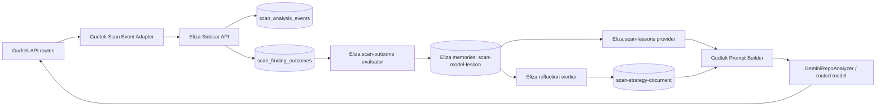

# Gudtek: RLM + Eliza Implementation Analysis

## Executive Summary

Gudtek already has a strong scan foundation:
- GitHub scan ingestion and feature extraction
- Gemini-based repository analysis and scoring
- persistent cache + append-only `analysis_history`
- gallery and score tracking views

What is missing is an explicit learning loop:
- outcomes are not captured as structured labels per finding
- no reward model
- no lesson memory system
- no adaptive model routing by measured quality

This document maps concrete implementation steps to Gudtek’s current code.

---

## 1. Gudtek Current Architecture (as observed)

### 1.1 Primary scan paths

- Single repo:
  - `app/api/github-legitimacy/route.ts`
- Multi-repo developer scan:
  - `app/api/developer-code-analysis/route.ts`
  - `app/api/developer-code-analysis-stream/route.ts`

### 1.2 Core analyzer

- Gemini model invocation and structured output:
  - `lib/geminiRepoAnalyzer.ts`
  - model: `gemini-3-pro-preview`

### 1.3 Data + cache

- cache utilities:
  - `lib/cache.ts`
- persistent snapshot history:
  - `analysis_history` writes via `setCachedAnalysis(...)`
- schema:
  - `supabase-migration.sql`
  - `scripts/add-analysis-history.sql`

### 1.4 Repository artifacts + fingerprints

- repo storage and file hash utilities:
  - `lib/repoStorage.ts`
- GitHub timeline/authenticity signal extraction:
  - `lib/githubFetcher.ts`

---

## 2. Gaps Relative to RLM

### 2.1 Missing per-finding outcome layer

Current outputs are cached as final report JSON, but not broken into durable findings with stable IDs and label lifecycle.

### 2.2 Missing reward function

No transformation from outcomes to normalized quality signal.

### 2.3 Missing lesson memory

No memory artifact akin to:
- `scan-model-lesson`
- `scan-strategy-document`

### 2.4 Missing model policy loop

Gemini is default in analyzer, but no policy engine decides when another model or fallback should be selected based on historical quality.

---

## 3. Recommended Gudtek + Eliza Integration Strategy

## 3.1 Integration model

Use **sidecar Eliza** for learning/orchestration while keeping Gudtek API/UI as primary product surface.

Why:
- minimal disruption to current Next.js app
- Eliza handles evaluators/providers/workers and memory semantics
- Gudtek remains authoritative source for scan execution and UX

## 3.2 Data flow

1. Gudtek scan completes (`github-legitimacy` or developer routes).
2. Gudtek posts normalized scan event to Eliza scan route.
3. Outcomes (manual review, scam confirmations, score reversals) are posted back.
4. Eliza evaluator stores lessons and strategy docs.
5. Gudtek requests lesson context before next scan prompt assembly.

---

## 4. Proposed Architecture

---

## 5. Gudtek-Specific Phase 0 Plan

### 5.1 New Gudtek schema additions

Add migration in Gudtek DB:
- `scan_analysis_events`
- `scan_finding_outcomes`

Use `analysis_history` as additional evidence stream but do not overload it with label semantics.

### 5.2 Gudtek code changes

- `app/api/github-legitimacy/route.ts`
  - after `analysis` is produced:
    - create normalized findings
    - persist analysis event
- `app/api/developer-code-analysis/route.ts`
  - persist one event per repo result
- `app/api/developer-code-analysis-stream/route.ts`
  - emit event on each `repo_complete`

### 5.3 New Gudtek endpoints

- `POST /api/scan/outcome`
  - accept labels from:
    - admin review actions
    - wall-of-shame confirmations
    - downstream correction tooling
- `GET /api/scan/metrics`
  - baseline trend readout

### 5.4 Finding key standardization

Create `lib/scanFindingKey.ts`:
- deterministic key from owner/repo/category/summary/filePath
- reusable across all phase1 routes

---

## 6. Gudtek-Specific Phase 1 Plan

### 6.1 Reward mapping

Implement `lib/scanReward.ts`:
- mapping table and optional confidence weighting
- pure function + tests

### 6.2 Outcome-to-lesson evaluator

Two options:

1. **In Gudtek directly**
   - cron/background script computes lessons and stores in new table.

2. **Preferred: Eliza sidecar**
   - send outcome rows to Eliza evaluator
   - store lessons in Eliza CUSTOM memories
   - pull top lessons on next scan

### 6.3 Initial lesson categories for Gudtek

- `timeline-fp-pattern`
- `copy-detection-calibration`
- `security-risk-signal-quality`
- `legitimacy-score-drift-cause`
- `repo-context-gap`

---

## 7. How to Introduce Eliza into Gudtek Safely

### 7.1 Phase A: passive sidecar

- Eliza only receives events/outcomes
- no prompt influence yet

### 7.2 Phase B: advisory lessons

- Gudtek fetches top lessons and logs them with proposed prompt augmentations
- does not change production prompt yet

### 7.3 Phase C: controlled injection

- enable lesson injection in canary traffic
- compare metrics vs control

### 7.4 Phase D: adaptive routing

- add model router policy using empirical performance
- keep fallback chain and rollback toggle

---

## 8. Concrete Integration Points in Gudtek

### Scan generation points
- `lib/geminiRepoAnalyzer.ts`
  - include `prompt_version`
  - include `analysis_trace_id` for correlation

### Event persistence points
- `app/api/github-legitimacy/route.ts`
- `app/api/developer-code-analysis/route.ts`
- `app/api/developer-code-analysis-stream/route.ts`

### Outcome signal sources
- admin moderation tools (for false positives / confirmations)
- wall-of-shame workflow
- repeated scan deltas in `analysis_history`

### Storage and history already useful
- `analysis_history` (append-only snapshots)
- `repo_file_hashes` and repo metadata for rich context features

---

## 9. Quality Metric Plan for Gudtek

### 9.1 Core metrics

- false-positive rate of red/security flags
- precision@k for high-severity findings
- confirmation rate against wall-of-shame outcomes
- score stability for unchanged repos
- score correction lead time after verified feedback

### 9.2 Drift indicators

- sudden shift in average legitimacy score by language cluster
- model-specific increase in `rejected_fp`
- rising contradiction between timeline flags and confirmed outcomes

---

## 10. Risk Controls for Gudtek

- never auto-penalize based on weak labels only
- require minimum sample size before policy updates
- keep human override on high-severity categories
- rollback switch for any new prompt/strategy version
- maintain audit trail:
  - event id
  - finding key
  - label source
  - strategy version

---

## 11. Suggested Execution Sequence

1. Build schema + endpoints (Phase 0).
2. Attach outcomes from existing moderation/review flows.
3. Add reward mapping + lesson extraction (Phase 1).
4. Run sidecar Eliza in passive mode.
5. Validate measured lift before enabling prompt/routing changes.

---

## 12. Recommendation

Implement RLM for Gudtek as a measured extension of current architecture, not a rewrite:
- keep Gudtek’s current phase1/phase2 APIs and UI unchanged for users
- add structured outcome learning and Eliza sidecar orchestration behind the scenes
- gate all model/prompt behavior changes with hard metrics.
